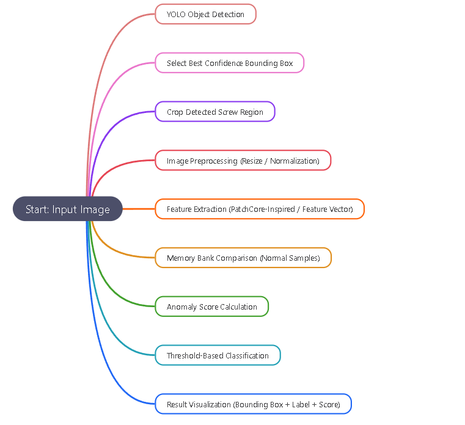
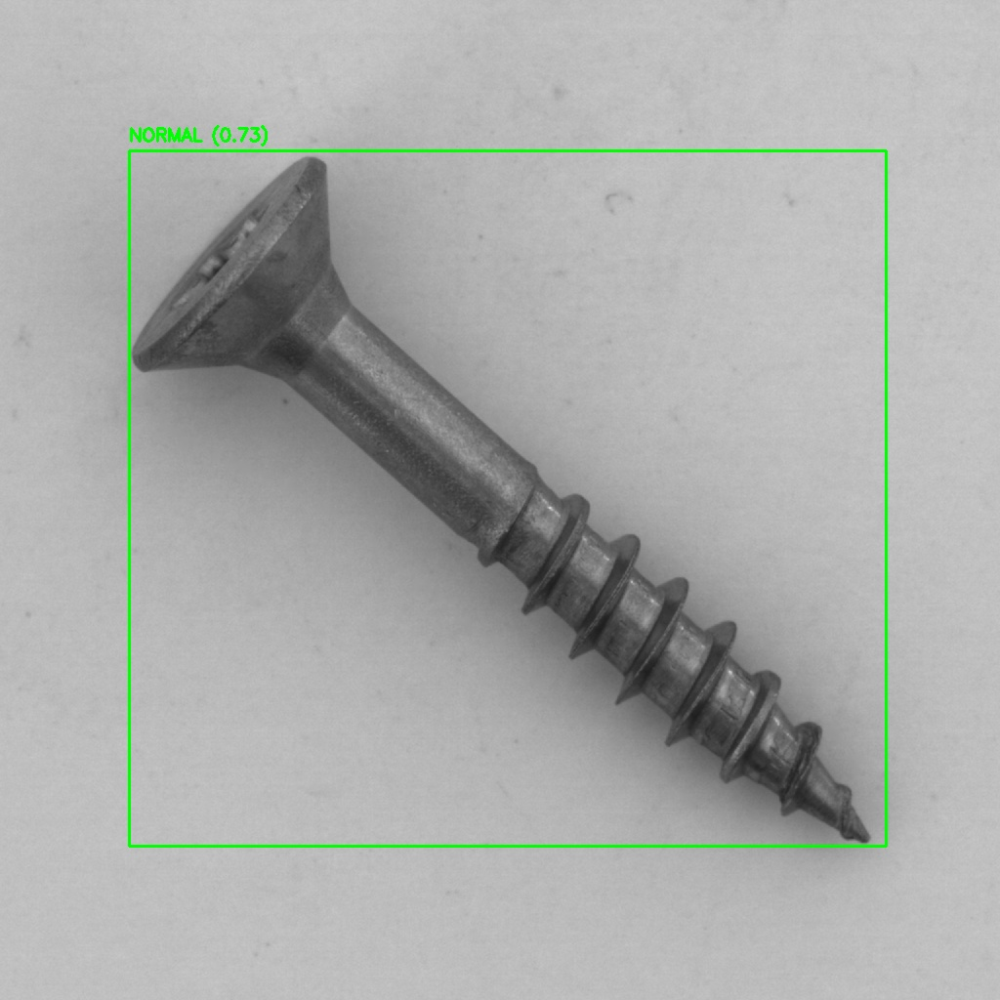
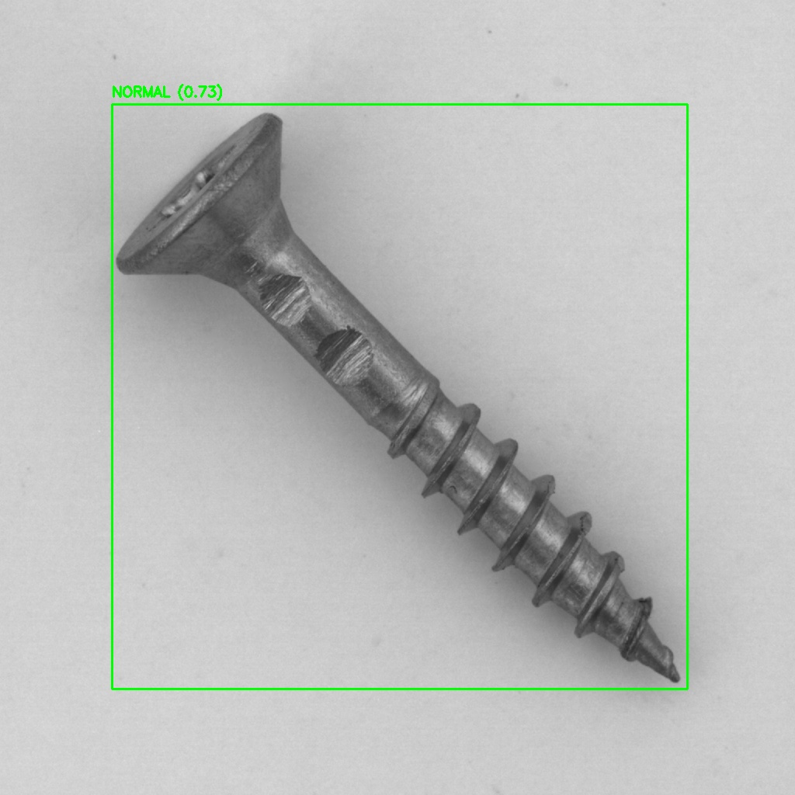

# 🔍 Industrial Anomaly Detection System (YOLO + PatchCore-Inspired)

## 📌 Overview
This project demonstrates an end-to-end industrial visual inspection pipeline for detecting surface defects on screws using a hybrid AI approach.

The system integrates:
- YOLO-based object detection for region localization
- Feature-based anomaly detection (PatchCore-inspired)
- Memory bank comparison using normal samples
- Visual heatmap and anomaly scoring

---

## ⚙️ System Pipeline

The system follows a hybrid industrial inspection workflow combining object detection and feature-based anomaly scoring.



---

### 1. Object Detection (YOLO)
A pretrained/custom YOLO model is used to locate the screw within the image. The detection with the highest confidence score is selected.

### 2. Region Cropping
The detected bounding box is used to extract the Region of Interest (ROI), focusing only on the screw surface.

### 3. Preprocessing
The cropped image is standardized through resizing and normalization to reduce lighting and scale variations.

### 4. Feature Extraction
A feature vector is extracted from the ROI using a lightweight PatchCore-inspired approach (or feature-based representation).

### 5. Memory Bank Comparison
The extracted feature is compared against a memory bank built from normal (defect-free) samples.

### 6. Anomaly Scoring
A similarity/distance-based score is computed. Higher values indicate higher deviation from normal patterns.

### 7. Classification
A threshold is applied to classify the result as:
- NORMAL
- ANOMALY

### 8. Visualization
The final output displays:
- Bounding box around detected screw
- Anomaly label
- Confidence/anomaly score

## 🧠 Key Features
- Real-time object detection using YOLO
- Feature-based anomaly detection (no need for defect labels)
- Memory bank built from normal samples only
- Anomaly scoring using similarity distance
- Visual output with bounding boxes and confidence score

---

## 🛠️ Technologies Used
- Python
- OpenCV
- Ultralytics YOLO
- Scikit-learn
- NumPy
- Custom PatchCore

---

## 📊 Results

The system can:
- Detect screws in images
- Identify surface defects (scratches, anomalies, irregularities)
- Classify results as **NORMAL / ANOMALY**
- Display bounding boxes with anomaly scores

Example outputs:
- Green box → Normal screw
- Red box → Defective screw

## 📊 Sample Results

The following results were automatically generated using Python inference pipeline:


---

## ⚠️ Limitations & Future Improvements

This project is a proof-of-concept system and has the following limitations:

- Standard bounding boxes may include background noise
- Performance depends on YOLO detection accuracy
- Feature-based anomaly detection is sensitive to lighting conditions

### Future improvements:
- Implementation of Oriented Bounding Boxes (OBB) for better alignment
- Use of deep feature extractors (ResNet / PatchCore full implementation)
- Improved dataset normalization and lighting correction
- Real-time industrial deployment optimization

---

## 🚀 How to Run

```bash
pip install -r requirements.txt
python src/main.py